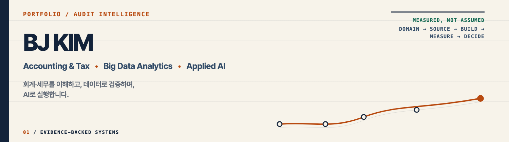

<div align="center">
  
</div>

# 안녕하세요, BJ Kim입니다

**KOSPI D사 결산 담당 · 프로젝트 기반 데이터 애널리스트**  
**회계·세무 도메인 × 빅데이터 분석 × 실전 AI 자동화**

학부에서 회계학을 전공했고, 최종학력은 빅데이터 석사입니다. 2017년 7월부터 회계·세무 실무를 수행해 온 9년차 실무자로, 휴직 등을 제외한 실경력은 8년 5개월입니다. 본업에서는 KOSPI D사의 결산·DART 공시(XBRL)·세무·내부통제를 담당하고, 외부 프로젝트에서는 데이터 애널리스트로 활동합니다. 업무 문제를 데이터로 분석하고 AI 시스템으로 구현하며, 기능의 수보다 **공식 근거, 재현 가능한 측정, 실제 실행 결과**를 중요하게 생각합니다.

## What I Do

| Accounting & Tax | Data Analytics | Applied AI |
|---|---|---|
| 회계기준·세법·공시·ERP 데이터의 구조를 해석합니다. | SQL·Python으로 대사, 이상 탐지, 재무 분석과 평가 하네스를 만듭니다. | 근거 기반 검색, 에이전트 워크플로, 로컬 자동화 시스템을 구축합니다. |

## Selected Work

### [Pareto Measurement Gates](https://github.com/kims6305-bjk/pareto-measurement-gates)

검증 레이어를 무조건 추가하지 않고, 품질과 비용을 함께 측정해 **유지·축소·제거**를 판정하는 공개 하네스입니다.

- 사전등록 → 블라인드 채점 → 통계 판정의 재현 가능한 절차
- 계기 검침 3회 판정에서 SPLIT 0/55
- 진단 비용 1,650콜 → 165콜
- 효과가 없던 메인 프로브를 실제로 폐기한 전 과정 공개

### Accounting & Tax Intelligence Systems `Sanitized`

회계기준, 세법, 판례와 실무 자료를 검색·대조해 근거와 함께 답하는 AI 시스템을 운영합니다.

- K-IFRS·법령·판례·해석례 기반 검색
- 주장과 인용 원문의 구조·주소·의미를 분리 검증
- 검색 품질을 골드셋과 리플레이로 측정
- 민감 데이터와 공개 지식소스를 분리한 로컬 우선 설계

> 내부 데이터와 운영 주소는 공개하지 않으며, 포트폴리오에는 합성 데이터와 익명화된 평가 결과만 사용합니다.

### Tax Filing Automation `Sanitized`

국세청 공식 수록형식과 신고 매뉴얼을 기준으로 전자신고 변환파일을 생성하는 로컬 데스크탑 워크플로를 구축했습니다.

- 신고 방식별 입력 마법사
- 공식 고정길이 레코드 규격 기반 출력
- CP949·파일 형식·자리수 검증
- 실행되는 더미와 실제로 유효한 결과물을 구분하는 원문 대조 게이트

### [ChatGPT Web Jjonku Writer](https://github.com/kims6305-bjk/chatgpt-web-jjonku-writer)

웹 ChatGPT가 로컬 저장소를 직접 수정하고 테스트·커밋·PR까지 수행할 수 있게 만든 제한형 MCP Git writer입니다.

- shell 미노출
- 저장소·브랜치·보호 경로 제한
- 실패 가드 self-check와 happy-path E2E 테스트
- 휴대폰에서 요청하고 PR로 검토하는 작업 흐름

## How I Work

```text
DOMAIN FIRST  →  SOURCE OF TRUTH  →  SMALL BUILD  →  REAL MEASUREMENT  →  KEEP OR REMOVE
```

- **Domain first:** 회계·세무 규칙과 실제 업무 흐름부터 이해합니다.
- **Measured, not assumed:** 성공 주장보다 분모·원자료·실행 결과를 남깁니다.
- **Privacy by boundary:** 내부 데이터, 공개 데이터, 합성 데모를 분리합니다.
- **Failure is evidence:** 실패하거나 기각된 실험도 재현 가능하게 기록합니다.

## Tools & Methods

`Python` `SQL` `SQLite` `Excel` `OpenDART` `XBRL` `RAG` `MCP` `LLM Evaluation` `GitHub Actions`

## Portfolio & Contact

상세 사례는 Notion 포트폴리오에서 `문제 → 접근 → 결과 → 증거 → 한계` 순서로 정리합니다.  
**Portfolio:** 준비 중  
**Email:** [kims6305@naver.com](mailto:kims6305@naver.com)

---

<sub>Accounting · Tax · Big Data · Applied AI — built with evidence.</sub>
